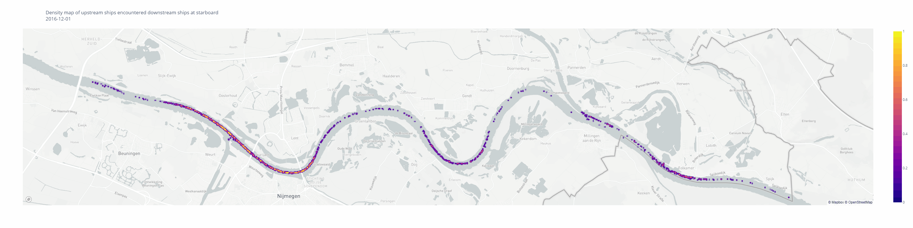

# Identify and visualize Dutch inland waterways vessel movement anomalies during low water levels

**Master thesis of Geographical Information Management and Application (MSc)**

Student: Chia-Yun Chang

Supervisor: Martijn Meijers (TU Delft), Fedor Baart (Deltares), Solange van der Werff (TU Delft)  
  
  
## Abstract

This MSc thesis aims to develop a workflow analyzing inland vessel traffic anomalies during low water levels by using historical automated identification system (AIS) data. Low water level impacts inland waterway transports because cargo ships must carry less weight in order to stay safe and afloat. The consequences are the same amount of freight needs more trips to be transported comparing to normal water level times, and more trips lead to busier waterways and higher freight rates. Many inland transportation reports and news articles have discussed the impacts of low water levels on inland shipping, but not many studies have used AIS data and water level data to analyze the relationship. Thus, this research tries to fill in this gap in two aspects: validate the market observations and detect vessel interaction anomalies.

## Study area

The study area is focused on the Waal from Lobith at the Dutch-German border to the bridge Tacitusbrug bij Ewijk.

## Examples

Wrong-side encounters' density map 2016-10

Wrong-side encounters' density map 2016-12

Wrong-side encounters' density map 2017-10

Wrong-side encounters' density map 2017-12

